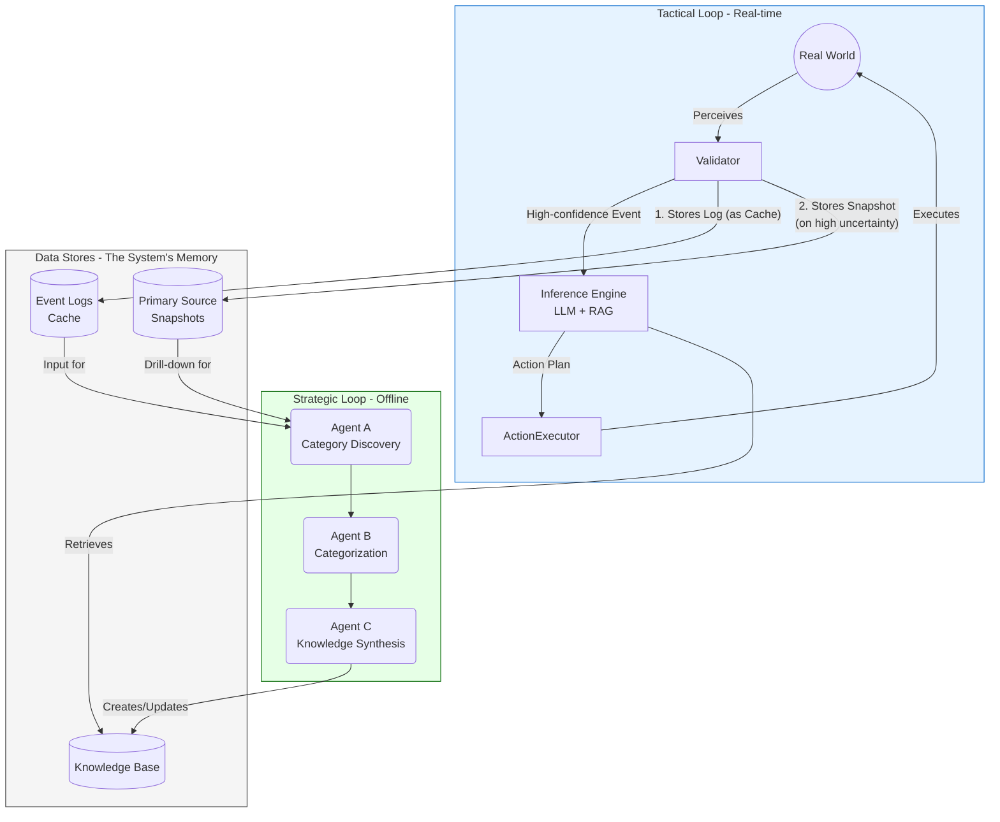

# プロジェクト構想：動的知覚・推論システム

## 1. コンセプト

**「人間の知覚と推理を、YOLO-WORLDとLLMで代替・拡張する」**

あらゆる事象を監視対象とし、状況をリアルタイムで認識（知覚）。その結果に基づき、LLMが次の行動を判断（推理）し、自律的にタスクを実行する動的なAIシステムを構築する。これにより、これまで人間が介在しなければならなかった様々な判断・操作を自動化し、より高度で汎用的な世界の実現を目指す。

**【コンセプトの深化】時系列データの活用**
検出したイベントを時系列データとしてデータベースに蓄積する。LLMは、その瞬間の出来事だけでなく、過去のイベント履歴（例：「5分以内に3回の軽微なエラーを検知」）も参照することで、文脈を理解し、より高度で複雑な判断（予兆検知など）を行うことが可能になる。

## 2. 具体的な利用シナリオ

### シナリオ1：スマートホームアシスタント

#### 知覚 (YOLO-WORLD)
部屋のWebカメラ映像から「窓」「雨粒」「人」を検出。
「窓が開いている」状態と、「雨が降っている」状態を認識します。

#### 推理 (LLM)
状況として、部屋に人がいない状況で、窓が開いたまま雨が降ってきました。
これを、濡れるのを防ぐため、窓を閉めるべきだと判断します。

#### 行動
スマートスピーカーから「窓が開いています。雨が降ってきたので閉めたほうが良いかもしれません」と音声で通知します。
スマートウィンドウシステムと連携し、自動で窓を閉めます。

### シナリオ2：工場ラインの異常検知

#### 知覚 (YOLO-WORLD)
ベルトコンベア上の製品画像を監視し、「製品の傷」「歪み」「異物混入」などの異常をリアルタイムで検出します。

#### 推理 (LLM)
状況として、不良品が連続して発生しています。
これを、生産ラインに問題が発生した可能性が高いと判断し、直ちにラインを停止し、管理者に状況を報告する必要があると考えます。

#### 行動
制御システムに信号を送り、生産ラインを緊急停止します。
検出した不良品画像、発生時刻、ライン番号を記載した報告メールを自動生成し、担当マネージャーに送信します。

### シナリオ3：工場ラインの"予兆"検知（時系列データ活用）

#### 知覚 & 状態記憶 (YOLO-WORLD + イベントログDB)
ベルトコンベア上の製品を監視し、「製品の微小な傷」「わずかな変色」などの軽微な異常を検出します。
検出した軽微な異常イベントは、タイムスタンプと共にイベントログDBに記録します。

#### 推理 (LLM)
状況として、イベントログDBを参照し、「過去10分以内に、軽微な異常検知が5回以上発生している」ことを把握します。
これを、生産設備の重大な故障につながる「予兆」である可能性が高いと判断し、通常の異常検知よりも緊急度を上げ、詳細な調査を促すべきだと考えます。

#### 行動
担当者のダッシュボードに最高レベルの警告を表示し、ポップアップで注意を喚起します。
過去10分間の異常検知ログ（画像、発生時刻リスト）を添付し、「重大な故障の予兆が検知されました。至急、製造装置XXの点検を実施してください」という内容のレポートを自動生成し、技術責任者に送信します。

## 3. 最終アーキテクチャ：二重ループ（キャッシュ戦略）

これまでの議論を経て、システムの信頼性、拡張性、そして自己進化能力を最大限に高めるため、最終的なアーキテクチャとして「二重ループ（Dual Loop）」構造を採用する。
この構造の核心は、**インターネット検索エンジンにおける「キャッシュ」の概念**である。

*   **一次情報ソース（＝Web全体）**: 映像やセンサーの生データ。全てがここにあるが、アクセスにはコストがかかる。
*   **イベントログ（＝検索インデックス/キャッシュ）**: 一次情報から頻繁に使う情報だけを高速に検索できる形で抽出・構造化したもの。日常的な判断の99%はこれで完結させる。
*   **一次ソース・スナップショット（＝実際のWebページ）**: キャッシュだけでは解決できない未知の事象が発生した際にのみ、コストをかけて直接分析しにいく完全な情報源。

この「キャッシュ戦略」により、リアルタイム性と、深く正確な分析能力という、トレードオフの関係にある要求を両立させる。



### 3.1. 戦術ループ (Tactical Loop) - リアルタイム処理系

目の前の出来事に即座に対応する、高速な処理ループ。

*   **Validator (知覚バリデーター)**: YOLO-WORLD等からの生の知覚情報を検証し、信頼度を評価。信頼できるイベントのみを後段に渡す。同時に、以下の2つのデータストアに情報を記録する責務も負う。
    1.  **イベントログ (Cache)**: 全ての検証済みイベントを、高速に検索可能な構造化データ（JSONなど）として記録する。
    2.  **一次ソース・スナップショット**: 判断に迷った（＝不確実性が高い）イベントや、特に重要なイベントが発生した際、その前後の生データ（映像クリップ等）を保存する。
*   **Inference Engine (推論エンジン)**: 検証済みイベントを受け取り、とるべき行動を判断する中核。LLMとRAG(Retrieval-Augmented Generation)を組み合わせる。戦略ループが構築した**ナレッジベース**をRAGで参照することで、過去の知見に基づいた、より高度で正確な推論を行う。
*   **Action Executor (アクション実行)**: 推論エンジンが決定した行動計画を、API連携や通知など、具体的な形で実行する。

### 3.2. 戦略ループ (Strategic Loop) - オフライン学習系

戦術ループが蓄積したデータを非同期で分析し、システム全体の「知性」を中長期的に向上させる学習ループ。Amazonの研究論文 `From Unstructured Communication to Intelligent RAG` のアプローチを採用する。

*   **Agent A: カテゴリ発見 (Category Discovery)**: 大量のイベントログ（キャッシュ）を分析し、未知の重要パターンを発見する。必要に応じて、一次ソース・スナップショットにまでドリルダウンし、イベントログだけでは分からない隠れた相関関係や法則性を探る。
*   **Agent B: カテゴリ分類 (Categorization)**: Agent Aが発見したカテゴリ定義に基づき、日々蓄積される新しいイベントログを分類・整理する。
*   **Agent C: ナレッジ合成 (Knowledge Synthesis)**: カテゴリごとに分類されたログ群の意味を解釈し、推論エンジンがRAGで利用するための高品質な**ナレッジベース記事**を生成・更新する。これにより、戦略ループの学習成果が、戦術ループのリアルタイム判断能力に直接的に貢献する。
``` 